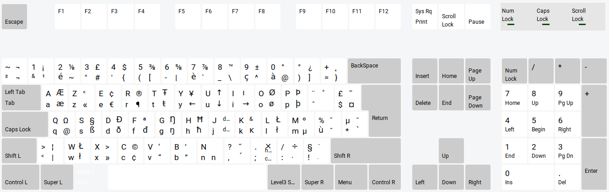

# Azerty French Keyboard
I began learning French through [Duolingo](https://www.duolingo.com) and
naturally, i thought i should know how to type french on my computer. So i
searched and found out that French uses a different type of keyboard called
`AZERTY` instead of our good-old `QWERTY`. The learning curve isn't steep and
here i'm going to tell you a few tricks to be able to type all those weird
diacritics that you find on the vowels. So let's begin.

## Key positions
I use Linux (obviously) and funny thing is there is a figure in gnome desktop
indicating the key layout. You can see that below but you can also see it by
going to the settings and click the `eye icon` right beside French in the
`Region & Language` section (of course you need to add the layout first).

So now you have a very good high-level understanding of the key locations, but
still, some characters are not there (hell i even can't find the one which
combines `o` and `e` yet!).

## Special characters

## Special diacritics
