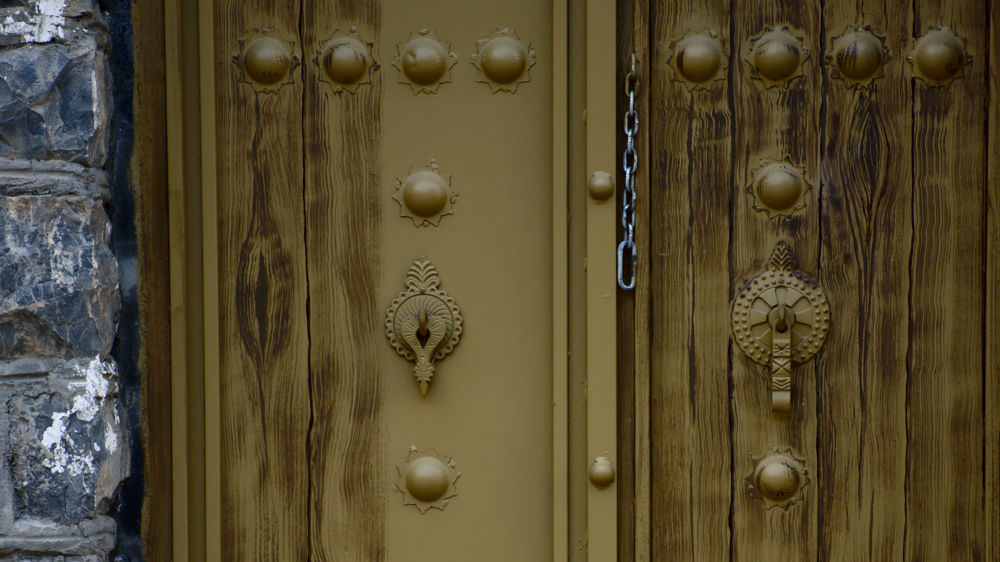
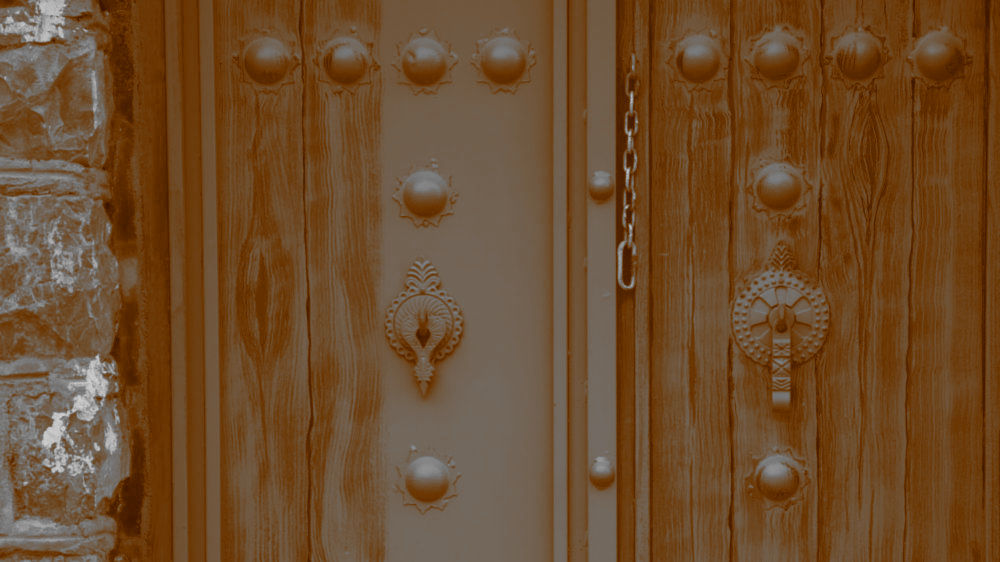
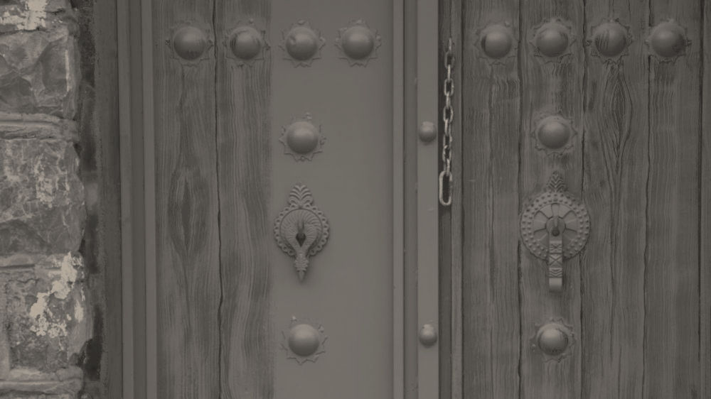
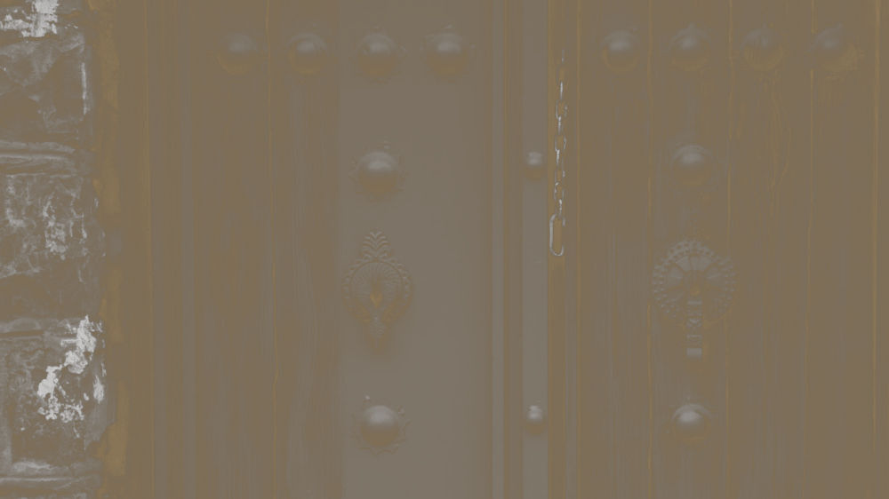
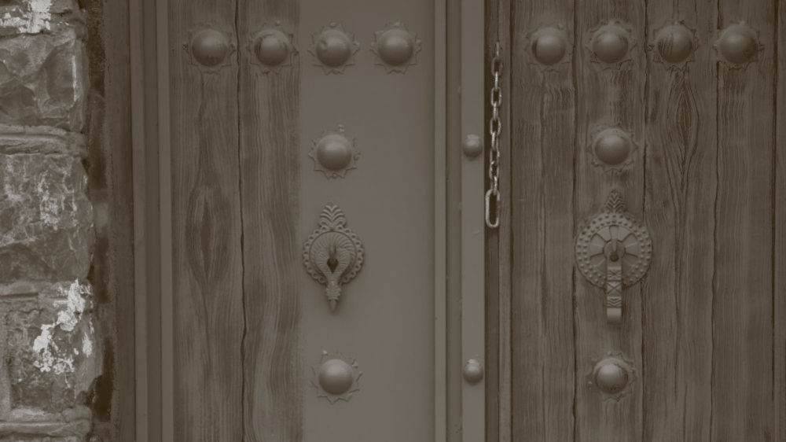

# Sepia old photo

## TL;DR
1. Filter => Decor => Old photo
1. Image => Mode => Grayscale
1. Image => Mode => RGB
1. New layer filled with `#a28a65` above the image
1. Add layer mask to that color layer
1. Copy original grayscale image and anchor to the layer mask
1. Invert the layer mask color
1. Change that layer's mode to LCh color

## Long version
Here is the method to make a photo old and orange! Well that's my way of
describing it but you guys should know what Sepia is. So let's make this
photo old:

First, we need to apply a gimp default filter called `Old photo` under `Decor`
from `Filter` (obviously). Remember to check the Sepia option in the dialog
that opens up. I also like to keep the border at zero since that's going to
add a white border gradient to the photo (just like old photos). The result
will look like this:

Then we'll go `Image => Mode => Grayscale` and then `Image => Mode => RGB`.
You may think that just using saturation and dropping it down to zero would
do the same thing, but trust me, i compared them and they result in different
images. Then we add an empty layer filled with `#a28a65` and add a layer mask
to it. Then copy the image (Ctrl+a Ctrl+c), select that layer mask by clicking
on it and then paste the layer (Ctrl+v), Finally anchor the floating pasted
layer to the layer mask by right clicking it and hitting `Anchor Layer`. You
may notice that the image slightly changes and the bright parts become warmer
(Since we are applying the same image as the layer mask then the parts that
are brighter will become warmer than the parts which are darker). It looks
like this:

Now if we invert the color of this layer mask, the dark parts will become warm
and light parts, not that much. It looks like this:

Finally, change the layer's mode to `LCh Color` and we're done:

At the end, you can adjust it however you want, you know, every image is
different.
