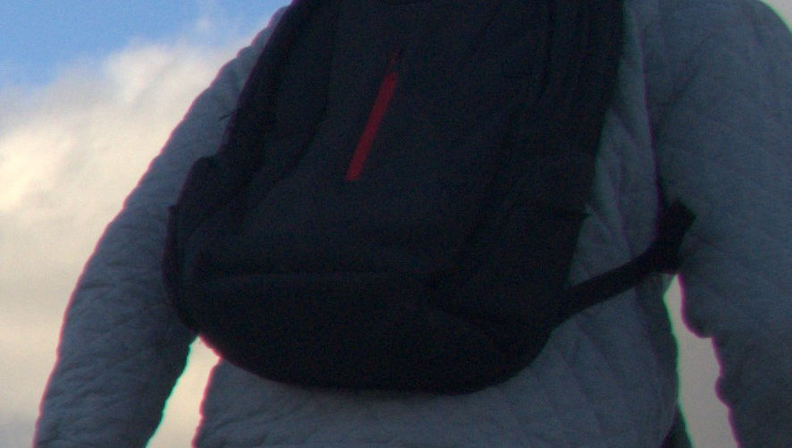
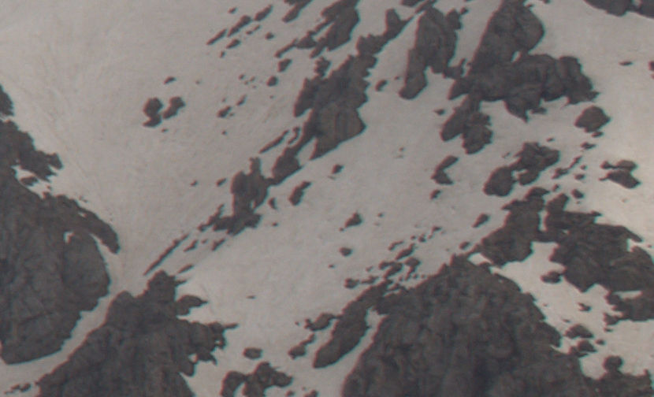
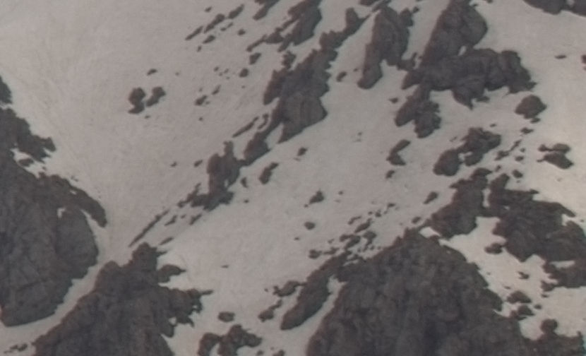

# Chromatic Abberation
Honestly from the moment i realized what this was, i couldn't stop noticing it
in every poor quality movie that i watch. But in photography, we can fix it
easily. This is our base image:

Just create a duplicate of the layer and apply a gaussian blur, the blur
should be enough to make the edge colors invisible (when you blur the
neighbour pixels get dissolved into each other so the man's coat and the sky
will be dissolving into those colorful edges). For this picture i think 7
pixels is enough. It should look something like this:

Then all we need to do is just to change that blur layer's mode to LCh Color:

You can see that the colors are dissolving into each other, of course the
result isn't perfect, not only the image looks a bit washed out but also the
colors are spreading instead of going away. This is because this image was a
very extreme example of chromatic abberation. But if you have a more normal
image like the one below, you can apply the same trick and get almost perfect
results, also if you have time, you can apply a layer mask on the blurred
layer and only apply the blurring effect on the parts where it needs fixing.

An image with less chromatic abberation that this trick almost perfectly fixes:

